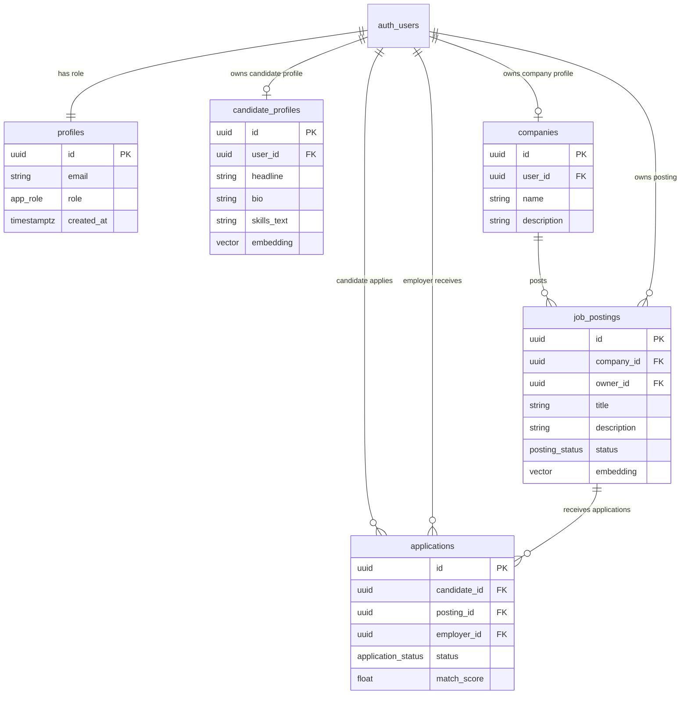
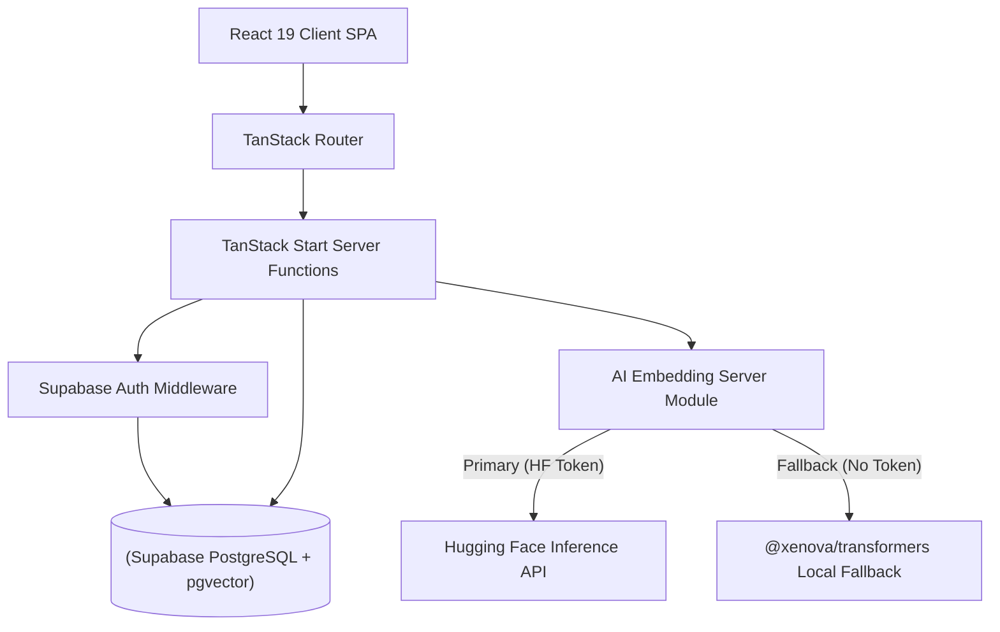
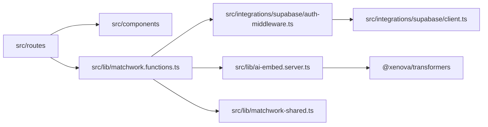
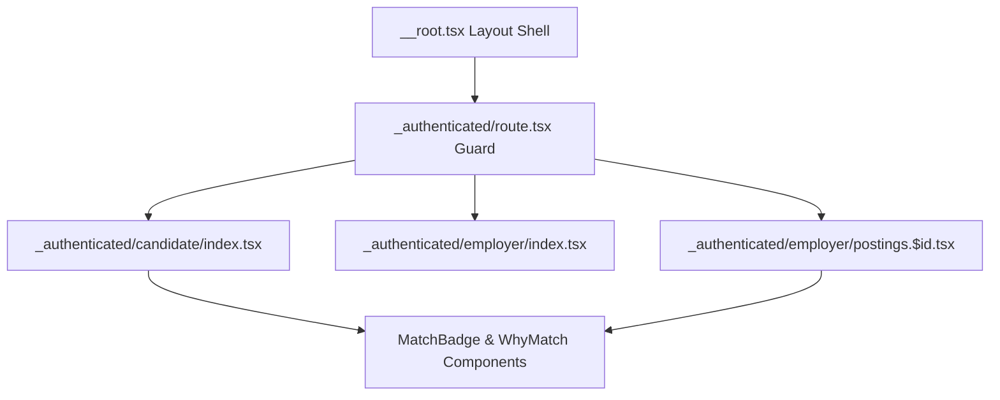
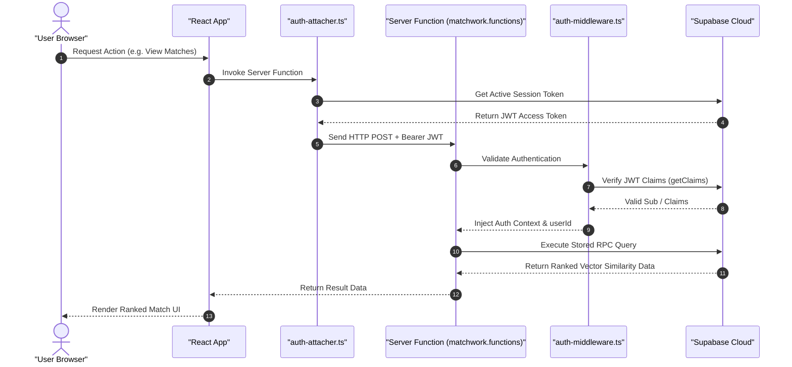
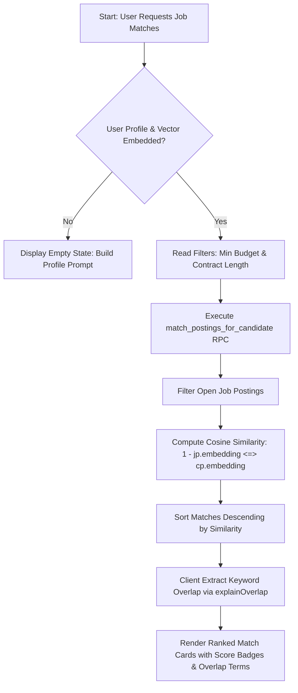

# MatchWork

**Semantic matching job platform for contract technical writers and hiring teams.**

MatchWork ranks technical writers and gigs by meaning and context rather than exact keyword matches. Built with modern web standards, TanStack Start, Supabase Cloud with `pgvector`, and Hugging Face embedding models.

---

## Table of Contents

- [Project Overview](#project-overview)
- [Features](#features)
- [Architecture Overview](#architecture-overview)
- [Project Structure](#project-structure)
- [Technology Stack](#technology-stack)
- [System Flow](#system-flow)
- [Installation](#installation)
- [Environment Variables](#environment-variables)
- [Available Scripts](#available-scripts)
- [Configuration](#configuration)
- [Database](#database)
  - [Schema & Models](#schema--models)
  - [Relationships & ER Diagram](#relationships--er-diagram)
  - [Stored Procedures (RPC)](#stored-procedures-rpc)
  - [Migrations & Seeding](#migrations--seeding)
- [API Documentation & Server Functions](#api-documentation--server-functions)
- [Authentication](#authentication)
- [Error Handling](#error-handling)
- [Logging](#logging)
- [Security](#security)
- [Testing](#testing)
- [Build Process](#build-process)
- [Deployment](#deployment)
- [CI/CD](#cicd)
- [Performance Optimisations](#performance-optimisations)
- [Dependency Analysis](#dependency-analysis)
- [Internal Workflows](#internal-workflows)
- [System Diagrams](#system-diagrams)
  - [Architecture Diagram](#architecture-diagram)
  - [Folder Dependency Diagram](#folder-dependency-diagram)
  - [Component Hierarchy Diagram](#component-hierarchy-diagram)
  - [Authentication & RPC Sequence Diagram](#authentication--rpc-sequence-diagram)
  - [Matching & Recommendation Flowchart](#matching--recommendation-flowchart)
- [Screenshots](#screenshots)
- [Troubleshooting](#troubleshooting)
- [Contributing](#contributing)
- [License](#license)
- [Future Improvements](#future-improvements)

---

## Project Overview

* **Project Name**: MatchWork (`tanstack_start_ts`)
* **Description**: MatchWork is a full-stack, niche-focused semantic job platform that connects contract technical writers with hiring organizations. Instead of relying on rigid keyword search taxonomies that fail when phrasing differs, MatchWork computes high-dimensional vector embeddings of candidate bio profiles and job posting descriptions to match candidates and roles based on underlying semantic intent.
* **Purpose**: Traditional job matching systems miss strong candidates when resume wording doesn't match job description buzzwords (for instance, candidate text stating *"led a small team through a product launch"* failing to surface for a posting requiring *"management experience"*). MatchWork solves this by computing cosine similarity over dense vector embeddings.
* **Problems Solved**:
  - Eliminates keyword gaming and rigid tag requirements on job boards.
  - Allows candidates to write free-form bios and headlines expressing their experience.
  - Allows employers to describe roles in natural language.
  - Provides explainable match scores with overlapping term extraction so both sides understand why a match occurred.
* **Target Users**:
  - **Contract Technical Writers**: Searching for contracts matching their skills, rate expectations, and availability.
  - **Hiring Teams & Employers**: Posting technical writing roles and seeking ranked, contextually relevant applicants.

---

## Features

### 1. Dual-Role Authentication & Onboarding
* **Role Selection**: Users register as either a `candidate` (Writer) or `employer` (Hiring Team).
* **Automatic Profile Bootstrapping**: Post-signup trigger and server function (`ensureProfile`) ensure user roles and profiles are persisted in Supabase Auth and database tables.

### 2. Semantic Profile & Job Embedding Generation
* **Free-Text Writer Profiles**: Writers define headlines, bios, skill sets, portfolio links, availability, and hourly rate ranges (`rate_min`, `rate_max`).
* **Natural Language Job Postings**: Employers create postings detailing project scope, required skills, project budget limits (`budget_min`, `budget_max`), and contract duration.
* **Automated Embeddings**: When saved, profile composite text and job posting text are passed through an embedding pipeline generating 1536-dimensional vectors for similarity calculation.

### 3. Dual Embedding Strategy (Serverless API + Local Fallback)
* **Hugging Face Inference API**: Uses `sentence-transformers/all-MiniLM-L6-v2` when `HF_TOKEN` / `HUGGINGFACE_API_KEY` is configured.
* **Local In-Memory Execution**: Automatically falls back to `@xenova/transformers` running `Xenova/all-MiniLM-L6-v2` locally when no API key is provided, guaranteeing zero external costs and 100% offline development capabilities.
* **Vector Normalization & Padding**: Automatically pads generated vectors to 1536 dimensions for PostgreSQL `pgvector` compatibility while maintaining exact cosine similarity geometry.

### 4. Vector Similarity Matching & Filtering
* **Candidate Job Feed**: Candidates see open job postings ranked by vector cosine similarity (`1 - cosine_distance`). Hard pre-filters (minimum budget, contract length string matching) run first, with semantic ranking applied to filtered results.
* **Employer Applicant Dashboard**: Employers view candidates who applied to their postings, ordered by semantic match score between the candidate profile and the posting description.
* **Explainable Match Scores ("Why This Matched")**: Natural language overlap extraction (`explainOverlap`) parses unigrams and bigrams from candidate profiles and job descriptions to present high-signal keyword badges explaining the match.

### 5. Application Management Lifecycle
* **One-Click Application**: Candidates submit applications to open job postings with automatically computed match scores.
* **Application Status Tracking**: Employers transition applications through status states (`applied` → `viewed` → `shortlisted` / `rejected` / `closed`).

---

## Architecture Overview

MatchWork is built as a full-stack, server-side rendered (SSR) web application using **TanStack Start** on top of **Vite** and the **Nitro** server engine.

```text
[ Browser Client ]
        │
        ▼ (HTTP / ServerFn RPC)
[ TanStack Start / Nitro Server ]
        │ ──► Authentication Middleware (requireSupabaseAuth)
        │ ──► AI Embedding Engine (Hugging Face API / @xenova/transformers)
        ▼
[ Supabase Cloud / PostgreSQL Database ]
        │ ──► pgvector HNSW Cosine Index
        │ ──► Row Level Security (RLS) Policies
        └──► RPC Functions (match_postings_for_candidate, match_candidates_for_posting)
```

* **Layer Responsibilities**:
  - **Presentation Layer (`src/routes`)**: Route-based components powered by `@tanstack/react-router`. Defines client UI, form handlers, and search param state.
  - **Data Access & Server Functions Layer (`src/lib/matchwork.functions.ts`)**: Type-safe RPC handlers built with `@tanstack/react-start`'s `createServerFn`, validated via `zod`.
  - **Authentication Middleware Layer (`src/integrations/supabase`)**: Client-side auth token attacher (`auth-attacher.ts`) and server-side JWT verification middleware (`auth-middleware.ts`).
  - **Embedding Layer (`src/lib/ai-embed.server.ts`)**: Isolated server module handling transformer feature extraction.
  - **Database Layer (`supabase/`)**: PostgreSQL schema, vector indexes, RLS policies, triggers, and RPC procedures.

---

## Project Structure

```text
MatchWork/
├── .env                       # Local environment variables
├── .gitignore                 # Git ignore configuration
├── .prettierignore            # Prettier ignore configuration
├── .prettierrc                # Prettier code formatting rules
├── AGENTS.md                  # Instructions for AI contributor agents
├── README.md                  # Project documentation
├── eslint.config.js           # ESLint v9 configuration with TypeScript & React plugins
├── package.json               # Project manifest, script definitions, dependencies
├── package-lock.json          # Dependency lockfile
├── tsconfig.json              # TypeScript compiler configuration
├── vite.config.ts             # Vite configuration with Lovable TanStack plugin
├── public/                    # Static assets
├── scripts/
│   ├── patch-tanstack-start.js # Post-install patch for TanStack Start compiler
│   └── seed-db.js             # Database seeding script for mock users, postings & vectors
├── src/
│   ├── components/
│   │   └── MatchBadge.tsx     # UI components for rendering match percentages & why-matched tags
│   ├── integrations/
│   │   └── supabase/
│   │       ├── auth-attacher.ts   # Client middleware attaching Bearer tokens to serverFn requests
│   │       ├── auth-middleware.ts # Server middleware verifying JWT claims and injecting Supabase client
│   │       ├── client.ts          # Client-side Supabase client instance (localStorage storage)
│   │       ├── client.server.ts   # Server-side Supabase admin client (Service Role key, bypasses RLS)
│   │       └── types.ts           # Auto-generated TypeScript types matching database schema
│   ├── lib/
│   │   ├── ai-embed.server.ts     # Server-only Hugging Face / Xenova vector embedding generator
│   │   ├── error-capture.ts       # Utility capturing unhandled SSR/h3 errors and cause chains
│   │   ├── error-page.ts          # Static HTML error boundary page renderer
│   │   ├── error-reporting.ts     # Client runtime error logging helper
│   │   ├── matchwork-shared.ts    # Shared pure utility functions (currency formatting, score scaling, overlap extraction)
│   │   ├── matchwork.functions.ts # TanStack Start Server Functions for data queries & mutations
│   │   └── utils.ts               # General UI styling utilities (clsx / tailwind-merge wrapper)
│   ├── routes/
│   │   ├── __root.tsx             # Root route layout, HTML shell, meta tags, and global error boundaries
│   │   ├── auth.tsx               # Sign in / Sign up page with role selector
│   │   ├── index.tsx              # Public landing page with feature explanations and interactive match preview
│   │   ├── sitemap[.]xml.ts       # Server route generating dynamically formatted sitemap.xml
│   │   └── _authenticated/
│   │       ├── route.tsx          # Authenticated layout guard (redirects unauthenticated users to /auth)
│   │       ├── dashboard.tsx      # Dashboard redirect router (routes user based on profile role)
│   │       ├── onboarding.tsx     # Role selection setup page for new accounts
│   │       ├── candidate/
│   │       │   ├── index.tsx      # Candidate job feed, search filters, and application actions
│   │       │   └── profile.tsx    # Candidate profile editor with embedding regeneration
│   │       └── employer/
│   │           ├── index.tsx      # Employer dashboard, company setup, and posting list
│   │           ├── postings.$id.tsx # Posting detail view with ranked applicant list & status management
│   │           └── postings.new.tsx # Job posting creation form with embedding generation
│   ├── routeTree.gen.ts       # Auto-generated TanStack Router route tree definitions
│   ├── router.tsx             # TanStack Router initialization with React Query provider
│   ├── server.ts             # SSR server entry point with error normalization wrapper
│   ├── start.ts              # TanStack Start instance configuration (CSRF & middleware setup)
│   └── styles.css             # Tailwind CSS styles and custom CSS color tokens
└── supabase/
    ├── config.toml            # Supabase CLI project configuration
    ├── schema_matchwork.sql   # Complete consolidated SQL database schema, RLS, & RPC definitions
    └── migrations/            # Version-controlled database migration scripts
        ├── 20260727163832_0e39181f-febb-483c-8312-b80d00b3875c.sql
        └── 20260727165159_5f933f1d-b397-48f0-a941-308078b3598f.sql
```

---

## Technology Stack

| Category | Technology / Library | Description / Usage |
| :--- | :--- | :--- |
| **Language** | TypeScript (v5.8.3) | Strict type-safety across client and server modules |
| **Framework** | TanStack Start (v1.168.26) | Full-stack SSR framework built on Vite and Nitro |
| **Routing** | TanStack Router (v1.170.16) | Fully type-safe file-based client and server routing |
| **UI Library** | React (v19.2.0) | Component-driven UI rendering engine |
| **Server Engine** | Nitro (v3.0.260603-beta) / Vite (v8.0.16) | Server-side rendering execution & asset bundling |
| **Styling & CSS** | Tailwind CSS (v4.2.1) | Utility-first CSS framework with `@tailwindcss/vite` |
| **State & Querying** | TanStack React Query (v5.101.1) | Async state management, caching, and cache invalidation |
| **Database** | Supabase Cloud / PostgreSQL | Database storage with `pgvector` extension enabled |
| **Vector Index** | HNSW (`vector_cosine_ops`) | Hierarchical Navigable Small World index for fast cosine distance matching |
| **AI / Embeddings** | Hugging Face Inference API / `@xenova/transformers` | Feature extraction model (`sentence-transformers/all-MiniLM-L6-v2`) |
| **Validation** | Zod (v3.24.2) | Schema validation for server function inputs and route params |
| **Notifications** | Sonner (v2.0.7) | Toast notifications for user actions |
| **Authentication** | Supabase Auth | JWT-based auth handling email/password sessions |
| **Code Quality** | ESLint (v9.32.0), Prettier (v3.7.3) | Code linting and formatting |

---

## System Flow

```text
[ Client Action ] (e.g., Save Profile / Post Job / View Matches)
       │
       ▼
[ TanStack Router Route ]
       │
       ▼
[ Client Auth Attacher ] ──► Retrieves access_token from Supabase Auth & adds 'Authorization: Bearer <token>'
       │
       ▼
[ Server Function RPC ] (`src/lib/matchwork.functions.ts`)
       │
       ▼
[ Server Auth Middleware ] ──► Validates JWT via `supabase.auth.getClaims()`, extracts `userId`
       │
       ▼
[ AI Embedding Generator ] (If content updated) ──► Computes 1536-d vector via HF API / Xenova local model
       │
       ▼
[ Database Query / RPC ] ──► Executes PostgreSQL RPC (`match_postings_for_candidate` / `match_candidates_for_posting`)
       │
       ▼
[ Vector Cosine Distance ] ──► Computes `1 - (embedding_a <=> embedding_b)` using HNSW vector index
       │
       ▼
[ Server Response ] ──► Returns sorted rows with match score & raw text for overlap explanation
       │
       ▼
[ React Component ] ──► Calculates overlap terms (`explainOverlap`) and renders match score UI
```

---

## Installation

### Prerequisites

* **Node.js**: `v18.0.0` or higher
* **Package Manager**: `npm` (v9+) or `bun` / `pnpm`
* **Supabase Project**: Active Supabase project with `vector` extension support

### Steps

1. **Clone the Repository**:
   ```bash
   git clone <repository-url>
   cd MatchWork
   ```

2. **Install Dependencies**:
   ```bash
   npm install
   ```
   *(Note: This automatically triggers `npm run postinstall`, which runs `scripts/patch-tanstack-start.js` to ensure TanStack Start compiler compatibility).*

3. **Configure Environment Variables**:
   Copy or create a `.env` file in the root directory:
   ```bash
   cp .env.example .env
   ```
   Populate the `.env` file with your credentials (see [Environment Variables](#environment-variables)).

4. **Initialize Database Schema**:
   Apply the database schema to your Supabase instance by running the SQL contents of `supabase/schema_matchwork.sql` inside the Supabase SQL Editor.

5. **(Optional) Seed Database**:
   Populate the database with mock candidate profiles, company accounts, job postings, and applications with pre-computed vector embeddings:
   ```bash
   node scripts/seed-db.js
   ```

6. **Run Development Server**:
   ```bash
   npm run dev
   ```
   Open `http://localhost:3000` in your browser.

---

## Environment Variables

| Variable | Required | Description |
| :--- | :--- | :--- |
| `SUPABASE_URL` | **Yes** | The primary Supabase project URL (used in server-side handlers). |
| `SUPABASE_PUBLISHABLE_KEY` | **Yes** | The publishable API key for Supabase (used in server-side user-authenticated requests). |
| `SUPABASE_SERVICE_ROLE_KEY` | **Yes** (Admin/Seed) | The secret service role key bypassing RLS. Used by `scripts/seed-db.js` and `client.server.ts`. |
| `VITE_SUPABASE_URL` | **Yes** | Client-side Vite environment variable mapping to `SUPABASE_URL`. |
| `VITE_SUPABASE_PUBLISHABLE_KEY` | **Yes** | Client-side Vite environment variable mapping to `SUPABASE_PUBLISHABLE_KEY`. |
| `HF_TOKEN` / `HUGGINGFACE_API_KEY` | Optional | Hugging Face Bearer Token for feature extraction via Serverless Inference API. If omitted, local transformer extraction runs automatically. |
| `HF_EMBEDDING_MODEL` | Optional | Hugging Face embedding model identifier. Defaults to `sentence-transformers/all-MiniLM-L6-v2`. |
| `SITE_URL` / `APP_URL` | Optional | Base canonical URL used when serving `sitemap.xml`. |

---

## Available Scripts

| Command | Purpose |
| :--- | :--- |
| `npm run dev` | Starts Vite dev server with TanStack Start SSR capabilities (`vite dev`). |
| `npm run build` | Builds production bundle with Vite (`vite build`). |
| `npm run build:dev` | Compiles build output in development mode for debugging (`vite build --mode development`). |
| `npm run preview` | Runs local server preview of production build (`vite preview`). |
| `npm run lint` | Runs ESLint across all TypeScript and React codebase files (`eslint .`). |
| `npm run format` | Formats all files using Prettier (`prettier --write .`). |
| `npm run postinstall` | Runs `node scripts/patch-tanstack-start.js` after package installation. |
| `node scripts/seed-db.js` | Seeds database with 60 candidates, 40 companies, 60 job postings, and 75 applications. |

---

## Configuration

* **`vite.config.ts`**: Configures Vite with `@lovable.dev/vite-tanstack-config`, sets up TypeScript path resolution, and points TanStack Start's server entry to `src/server.ts` for SSR error normalization.
* **`tsconfig.json`**: Configures TypeScript compiler settings, target ES2022, React JSX transform (`react-jsx`), and path aliases (`@/*` -> `./src/*`).
* **`eslint.config.js`**: ESLint flat config setting up rules for TypeScript, React Hooks, React Refresh, Prettier integration, and restricting prohibited imports like Next.js `server-only`.
* **`scripts/patch-tanstack-start.js`**: Modifies `@tanstack/start-plugin-core` node module post-install to resolve server function lookup module transformations.

---

## Database

### Schema & Models

The database consists of 5 primary tables managed in Supabase Cloud PostgreSQL:

1. **`public.profiles`**: Stores user role metadata mapped 1-to-1 with `auth.users`.
   - `id`: `uuid` (Primary Key, FK to `auth.users.id` ON DELETE CASCADE)
   - `email`: `text` (Not Null)
   - `role`: `public.app_role` (`'candidate'` or `'employer'`)
   - `created_at`, `updated_at`: `timestamptz`

2. **`public.candidate_profiles`**: Stores candidate writer information and vector embeddings.
   - `id`: `uuid` (Primary Key, default `gen_random_uuid()`)
   - `user_id`: `uuid` (Unique, FK to `auth.users.id` ON DELETE CASCADE)
   - `headline`, `bio`, `skills_text`, `portfolio_links`, `availability`: `text`
   - `rate_min`, `rate_max`: `integer`
   - `embedding`: `vector(1536)`
   - HNSW Index: `candidate_profiles_embedding_idx` using `vector_cosine_ops`

3. **`public.companies`**: Stores employer company information.
   - `id`: `uuid` (Primary Key, default `gen_random_uuid()`)
   - `user_id`: `uuid` (Unique, FK to `auth.users.id` ON DELETE CASCADE)
   - `name`: `text` (Not Null)
   - `description`: `text`

4. **`public.job_postings`**: Stores contract job postings and vector embeddings.
   - `id`: `uuid` (Primary Key, default `gen_random_uuid()`)
   - `company_id`: `uuid` (FK to `public.companies.id` ON DELETE CASCADE)
   - `owner_id`: `uuid` (FK to `auth.users.id` ON DELETE CASCADE)
   - `title`, `description`, `required_skills_text`, `contract_length`: `text`
   - `budget_min`, `budget_max`: `integer`
   - `status`: `public.posting_status` (`'open'` or `'closed'`)
   - `embedding`: `vector(1536)`
   - HNSW Index: `job_postings_embedding_idx` using `vector_cosine_ops`

5. **`public.applications`**: Stores candidate applications to job postings.
   - `id`: `uuid` (Primary Key, default `gen_random_uuid()`)
   - `candidate_id`: `uuid` (FK to `auth.users.id` ON DELETE CASCADE)
   - `posting_id`: `uuid` (FK to `public.job_postings.id` ON DELETE CASCADE)
   - `employer_id`: `uuid` (FK to `auth.users.id` ON DELETE CASCADE)
   - `status`: `public.application_status` (`'applied'`, `'viewed'`, `'shortlisted'`, `'rejected'`, `'closed'`)
   - `match_score`: `real`
   - Unique Constraint: `(candidate_id, posting_id)`

### Relationships & ER Diagram



### Stored Procedures (RPC)

1. **`match_postings_for_candidate`**:
   Ranks open job postings for a candidate using vector cosine distance:
   $$\text{similarity} = 1 - (\text{job\_postings.embedding} \Leftrightarrow \text{candidate\_profiles.embedding})$$
   Applies optional budget and contract length filters, returning ordered matches.

2. **`match_candidates_for_posting`**:
   Ranks applicants who submitted applications for a specific job posting based on cosine similarity between the candidate's vector profile and the posting's vector embedding.

### Migrations & Seeding

* **Migrations**: Stored in `supabase/migrations/` and consolidated in `supabase/schema_matchwork.sql`.
* **Database Seeder (`scripts/seed-db.js`)**: Executes using Supabase Service Role key to create realistic mock data:
  - 60 Candidate auth users & profiles with vector embeddings.
  - 40 Employer auth users & company records.
  - 60 Job postings with custom budget ranges and vector embeddings.
  - 75 Job applications linking candidate profiles to postings with calculated match scores.

---

## API Documentation & Server Functions

All backend endpoints are implemented as type-safe TanStack Start **Server Functions** in `src/lib/matchwork.functions.ts`.

| Function | Method | Middleware | Inputs | Description |
| :--- | :--- | :--- | :--- | :--- |
| `ensureProfile` | `POST` | `requireSupabaseAuth` | `{ role: "candidate" \| "employer", email: string }` | Bootstraps or returns existing profile row. |
| `getMyProfile` | `GET` | `requireSupabaseAuth` | None | Retrieves user profile metadata (`id`, `email`, `role`). |
| `getMyCandidateProfile` | `GET` | `requireSupabaseAuth` | None | Retrieves current user's candidate profile record. |
| `saveCandidateProfile` | `POST` | `requireSupabaseAuth` | Headline, bio, skills, portfolio, availability, rates | Generates embedding and upserts candidate profile. |
| `getMyCompany` | `GET` | `requireSupabaseAuth` | None | Retrieves company owned by current user. |
| `saveMyCompany` | `POST` | `requireSupabaseAuth` | `{ name: string, description: string }` | Upserts company profile. |
| `saveJobPosting` | `POST` | `requireSupabaseAuth` | Title, description, skills, budget, contract length | Generates embedding and inserts/updates job posting. |
| `listMyPostings` | `GET` | `requireSupabaseAuth` | None | Fetches all postings owned by current employer. |
| `getPostingForOwner` | `POST` | `requireSupabaseAuth` | `{ id: string }` | Fetches single job posting owned by current user. |
| `getPostingPublic` | `POST` | `requireSupabaseAuth` | `{ id: string }` | Fetches single job posting (public view). |
| `closePosting` | `POST` | `requireSupabaseAuth` | `{ id: string }` | Marks job posting status as `'closed'`. |
| `rankPostingsForMe` | `POST` | `requireSupabaseAuth` | `{ budget_min?, budget_max?, contract_length? }` | Executes `match_postings_for_candidate` RPC and returns ranked job matches. |
| `rankCandidatesForPosting`| `POST` | `requireSupabaseAuth` | `{ posting_id: string }` | Executes `match_candidates_for_posting` RPC and returns ranked applicants. |
| `applyToPosting` | `POST` | `requireSupabaseAuth` | `{ posting_id: string }` | Submits candidate application and stores computed match score. |
| `listMyApplications` | `GET` | `requireSupabaseAuth` | None | Fetches all job applications submitted by candidate. |
| `updateApplicationStatus` | `POST` | `requireSupabaseAuth` | `{ id: string, status: application_status }` | Updates application status (`applied`, `viewed`, `shortlisted`, `rejected`, `closed`). |

---

## Authentication

MatchWork utilizes **Supabase Auth** for identity management.

1. **Client Storage & Persistence**: Supabase client (`src/integrations/supabase/client.ts`) uses `localStorage` in browser environments with automatic token refresh (`autoRefreshToken: true`).
2. **Server Function Token Passing**: The client-side middleware `attachSupabaseAuth` intercepts all `serverFn` calls and extracts the JWT `access_token` from active Supabase sessions, appending an `Authorization: Bearer <token>` header to outbound HTTP requests.
3. **Server-Side Token Verification**: The server-side middleware `requireSupabaseAuth` intercepts requests, extracts the Bearer token, validates claims using `supabase.auth.getClaims(token)`, extracts `claims.sub` as `userId`, and constructs an authenticated Supabase client scoped to the user context.
4. **Route Protection**: The route layout guard (`src/routes/_authenticated/route.tsx`) executes `beforeLoad` checks to verify authentication state before rendering protected child routes (`/candidate`, `/employer`, `/onboarding`, `/dashboard`).

---

## Error Handling

MatchWork implements a multi-tiered error recovery and reporting system:

1. **Server Function Validation**: Inputs are validated with Zod schemas. Invalid payloads throw structured errors caught by client-side react-query mutations.
2. **Catastrophic SSR Error Normalization (`src/server.ts`)**: Nitro/h3 swallows server-side rendering throws into standard JSON 500 error responses (`{"unhandled":true,"message":"HTTPError"}`). `src/server.ts` intercepts these responses, retrieves the original error stack from `src/lib/error-capture.ts`, and returns a user-friendly HTML error page rendered by `renderErrorPage()`.
3. **TanStack Router Error Boundaries**: `ErrorComponent` inside `src/routes/__root.tsx` catches runtime rendering errors and allows users to revalidate and reset route state.
4. **Client Toast Alerts**: Application actions leverage `sonner` to render contextual error toasts on failed mutations or network failures.

---

## Logging

* **Server Logging**: Server function failures, missing environment variables, and swallowed SSR exceptions are formatted using `describeError()` (`src/lib/error-capture.ts`), expanding cause chains up to 5 levels deep and logging clean multi-line tracebacks to stdout/stderr.
* **Client Logging**: Client-side errors caught by global handlers or error boundaries pass to `reportRuntimeError()` (`src/lib/error-reporting.ts`), outputting structured diagnostic objects to the console.

---

## Security

* **Row Level Security (RLS)**: RLS is strictly enabled on all database tables (`profiles`, `candidate_profiles`, `companies`, `job_postings`, `applications`). Policies ensure users can only modify their own records and view applicant profiles scoped to active job applications.
* **CSRF Protection**: Server function requests are protected against Cross-Site Request Forgery via `createCsrfMiddleware` registered in `src/start.ts`.
* **API Key Handling**: API requests discriminate between standard Supabase opaque keys (`sb_publishable_`) and legacy JWT bearer headers, ensuring security headers (`apikey`) are attached correctly without token leakage.
* **Admin Key Isolation**: Service Role Admin Client (`src/integrations/supabase/client.server.ts`) is strictly isolated to server-only execution modules, preventing key exposure in browser bundles.

---

## Testing

* **Repository State**: No automated unit test runner (such as Vitest or Jest) is currently configured in `package.json`.
* **Verification Workflow**:
  - **Static Analysis & Type Checking**: Verified via TypeScript compiler (`tsc`) and ESLint (`npm run lint`).
  - **Integration & Seeding Verification**: Verified using `scripts/seed-db.js`, which asserts end-to-end user creation, vector embedding insertion, RPC execution, and row count verification across database tables.

---

## Build Process

MatchWork uses **Vite** and **TanStack Start** compiler plugins to produce a production build.

1. **Post-install Patching**: `npm run postinstall` executes `scripts/patch-tanstack-start.js` to patch `@tanstack/start-plugin-core` for server function lookup resolution.
2. **Compilation**: Running `npm run build` triggers `vite build`, compiling React TSX components into client assets and server bundle entries handled by Nitro.
3. **Asset Production**: Static files are emitted to `.output/` for deployment.

---

## Deployment

The application is designed for serverless or Node.js SSR deployment platforms (e.g. Vercel, Netlify, Cloudflare Workers, or Docker/Node.js host):

1. **Build Production Artifacts**:
   ```bash
   npm run build
   ```
2. **Set Environment Variables**: Configure production environment variables (`SUPABASE_URL`, `SUPABASE_PUBLISHABLE_KEY`, `SUPABASE_SERVICE_ROLE_KEY`, `HF_TOKEN`).
3. **Start Production Server**:
   ```bash
   npm run preview
   ```
   Or deploy the `.output/` directory directly to your serverless host.

---

## CI/CD

* **Repository State**: No CI/CD workflows (such as GitHub Actions `.github/workflows`) are currently present in the repository.
* **Recommended Pipeline**:
  - Step 1: Run `npm ci`
  - Step 2: Run `npm run lint`
  - Step 3: Run `npx tsc --noEmit`
  - Step 4: Run `npm run build`

---

## Performance Optimisations

1. **HNSW Cosine Vector Indexing**: PostgreSQL vector columns use `hnsw` indexes (`vector_cosine_ops`), enabling fast approximate nearest neighbor search over thousands of embeddings.
2. **Server Function Bundling**: Server functions compile into isolated RPC endpoints, avoiding client bundle bloating.
3. **Local Quantized Embeddings**: When running locally without HF API tokens, `@xenova/transformers` uses 8-bit quantized models (`quantized: true`) for lightweight RAM usage and fast CPU inference.
4. **React Query Invalidation**: Smart cache invalidation (`queryClient.invalidateQueries`) ensures UI updates immediately after profile saves or application submissions without full page reloads.

---

## Dependency Analysis

* **`@tanstack/react-start` & `@tanstack/react-router`**: Enables type-safe full-stack SSR and route management.
* **`@supabase/supabase-js`**: Interacts with Supabase PostgreSQL database, authentication system, and RPC functions.
* **`@xenova/transformers`**: Provides in-browser and local Node.js feature extraction for Hugging Face transformer models without cloud service dependency.
* **`tailwindcss` & `@tailwindcss/vite`**: Delivers utility-first, high-performance CSS styling.
* **`zod`**: Provides strict runtime schema validation for server function RPC payloads.
* **`sonner`**: Handles accessible, styled toast notifications.

---

## Internal Workflows

### Candidate Matching & Application Workflow

```text
[ Candidate ] ──► Edits Profile in /candidate/profile
                     │
                     ▼
             [ Server Function ] (saveCandidateProfile)
                     │
                     ▼
             [ AI Embedding Generator ] ──► Generates 1536-d vector
                     │
                     ▼
             [ Database ] ──► Upserts candidate_profiles (embedding)
                     │
                     ▼
[ Candidate ] ──► Views Matches in /candidate
                     │
                     ▼
             [ Database RPC ] (match_postings_for_candidate)
                     │
                     ▼
             [ Client UI ] ──► Renders Ranked Jobs + Overlap Badges ("Why Matched")
                     │
                     ▼
[ Candidate ] ──► Clicks Apply ──► Upserts applications table with match_score
```

---

## System Diagrams

### Architecture Diagram



### Folder Dependency Diagram



### Component Hierarchy Diagram



### Authentication & RPC Sequence Diagram



### Matching & Recommendation Flowchart



---

## Screenshots

*Note: Screenshots should be placed in `./docs/screenshots/` once generated.*

* **Landing Page**: `./docs/screenshots/landing.png` — Highlighting value proposition and semantic match previews.
* **Candidate Job Feed**: `./docs/screenshots/candidate_dashboard.png` — Showing ranked postings with percentage badges and overlap tags.
* **Employer Applicants View**: `./docs/screenshots/employer_dashboard.png` — Displaying applicants ranked by semantic fit with application status controls.

---

## Troubleshooting

### 1. Missing Supabase Environment Variables Error
* **Symptom**: Server throws `Missing Supabase environment variable(s): SUPABASE_URL, SUPABASE_PUBLISHABLE_KEY`.
* **Fix**: Ensure your `.env` file exists in the root directory and contains `SUPABASE_URL` and `SUPABASE_PUBLISHABLE_KEY`. Restart your development server (`npm run dev`).

### 2. Hugging Face API Rate Limit / Network Warnings
* **Symptom**: Console logs `Hugging Face API call failed, falling back to local model`.
* **Fix**: This is expected fallback behavior when `HF_TOKEN` is invalid or un-configured. The system seamlessly falls back to `@xenova/transformers` executing locally without breaking app functionality.

### 3. Database Seeding Script Fails
* **Symptom**: Running `node scripts/seed-db.js` outputs `Missing SUPABASE_URL or SUPABASE_SERVICE_ROLE_KEY`.
* **Fix**: Verify `SUPABASE_SERVICE_ROLE_KEY` is present in your `.env` file. The seeder requires service role privileges to create auth users and bypass RLS.

### 4. Vector Distance Operator Errors in Postgres
* **Symptom**: SQL error stating `operator does not exist: vector <=> vector`.
* **Fix**: Ensure the `pgvector` extension is enabled in your database by running `create extension if not exists vector;` in the Supabase SQL Editor before running migrations.

---

## Contributing

1. Fork the repository.
2. Create your feature branch (`git checkout -b feature/amazing-feature`).
3. Ensure formatting and linting rules pass:
   ```bash
   npm run lint
   npm run format
   ```
4. Commit your changes (`git commit -m 'Add amazing feature'`).
5. Push to the branch (`git push origin feature/amazing-feature`).
6. Open a Pull Request.

---

## License

This project is licensed under the [MIT License](LICENSE) — see the [LICENSE](LICENSE) file for details.

---
